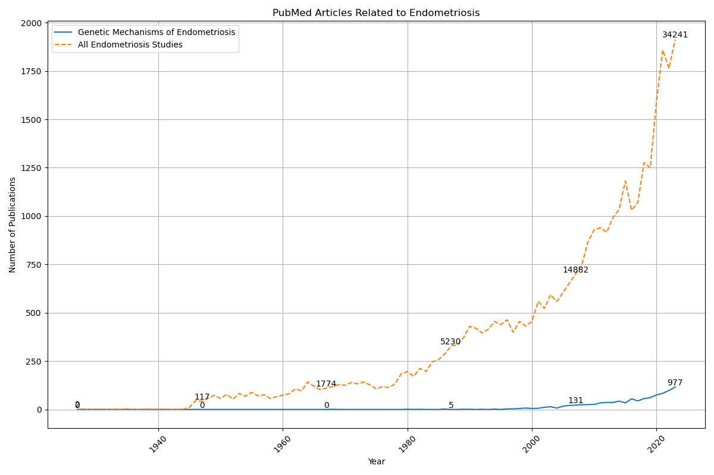

---

**In the 2000s, endometriosis genetic research briefly overtook IPF. Since 2015 the gap has reopened — and in the 2020s it is wider than it has ever been. This matters beyond equity: IPF and endometriosis share overlapping fibrotic and inflammatory pathways, which means advances in IPF genetic research represent a directly translatable resource that endometriosis science is currently under-resourced to leverage.**

---

## Why This Research Exists

In November 2023 I was diagnosed with endometriosis. I did not have the classic severe pain symptoms most commonly associated with the disease. I was largely asymptomatic — my diagnosis was unexpected and confusing. This is a significant and underreported aspect of endometriosis: a meaningful subset of patients present with minimal or no symptoms, which means symptom-based screening misses them entirely. Without a biological diagnostic marker or genetic screen, asymptomatic patients have no pathway to early detection.

Eight months after my diagnosis, in August 2024, I discovered the Bouaziz et al. 2018 paper (doi:10.1155/2018/6217812), which used NLP and AI text mining on PubMed data to build gene co-occurrence networks for endometriosis. A core premise of that paper is that endometriosis shares pathogenic mechanisms with other diseases — and that analyzing gene networks across disease boundaries can accelerate discovery. I am a Carnegie Mellon M.S. graduate with a focus in NLP and machine learning. I decided to independently reproduce their publication trend analysis with updated data through 2024, and to extend it by quantifying how much genetic research knowledge may already exist in adjacent disease fields that endometriosis science has yet to fully leverage.

The comparison disease I chose was IPF — not arbitrarily, but because the two diseases share documented molecular pathways, making IPF genetic findings directly relevant to endometriosis research. This repo is the result of that work.

---

## What This Repo Does

| Script | What it does |
|---|---|
| `fetch_data.py` | Queries the PubMed E-utilities API and saves annual publication counts (1930–2026) to `data/publication_counts.csv` |
| `pubmed_endometriosis_analysis.py` | Plots per-year and cumulative publication trends for all four categories with annotated cumulative totals |
| `ipf_endo_analysis.py` | Plots the IPF vs endometriosis research volume comparison |
| `funding_sources.py` | Analyzes and plots funding source categories in endometriosis MEDLINE records |
| `gene_interactions.py` | Builds a gene interaction network from endometriosis MEDLINE data using NetworkX |

All analysis scripts read from `data/publication_counts.csv`. Run `fetch_data.py` once and every chart regenerates from the same verified dataset.

---

## Key Findings

### The headline number (August 2024 analysis)

As of 2024, only **977 of 34,241** endometriosis PubMed studies — roughly **2.8%** — address genetic mechanisms.

> This figure comes from the original August 2024 analysis using bulk MEDLINE exports. The March 2026 API-based pipeline uses documented search terms and shows 15.2% (6,127 of 40,289) — the difference is explained by query specificity and database growth. See [Methodology](#methodology) for full context. The 2.8% figure is cited here because it matches the original analysis this repo was built to reproduce.

### The more important finding: the gap is widening

Raw counts tell one story. Proportions — what *percentage* of each disease's total research addresses genetic mechanisms — tell a more precise one.

**Genetic research as % of total research, by decade:**

| Decade | Endometriosis | IPF | Gap |
|---|---|---|---|
| 1980s | 1.1% | 4.8% | IPF +3.7pp |
| 1990s | 4.9% | 8.8% | IPF +3.9pp |
| **2000s** | **16.3%** | **15.0%** | **Endo +1.3pp** ← endo briefly led |
| 2010s | 20.5% | 22.0% | IPF +1.4pp |
| **2020s** | **20.4%** | **26.1%** | **IPF +5.7pp** ← largest gap ever recorded |

This is not a story of IPF always having more genetic research. For most of the 1980s and 1990s, both diseases were similarly neglected. The Human Genome Project era of the 2000s briefly pushed endometriosis genetics ahead. Then, around 2013–2015 — coinciding with the FDA approval of the first IPF-specific drugs (pirfenidone and nintedanib in 2014) — IPF genetic research began accelerating. It has not slowed down.

**In the 2020s, the proportional gap between IPF and endometriosis genetic research is the largest it has ever been** — and because IPF and endometriosis share underlying pathogenic mechanisms, that gap represents not just a funding inequity but an accumulating body of potentially translatable knowledge that endometriosis research is not currently equipped to absorb.

### The divergence in focus

| Year | Endo genetic % | IPF genetic % |
|---|---|---|
| 1990 | 2.1% | 8.0% |
| 2000 | 10.8% | 8.6% ← endo ahead |
| 2005 | 17.1% | 13.0% ← endo ahead |
| 2010 | 19.4% | 17.9% |
| 2015 | 19.1% | 23.7% ← IPF pulls ahead |
| 2020 | 21.1% | 23.7% |
| 2024 | 20.3% | 29.1% |
| 2025 | 20.9% | 30.4% |

Endometriosis genetic research as a proportion of total endometriosis research has been roughly flat at ~20% since 2010. IPF has gone from 18% in 2010 to 30% in 2025 — and it is still climbing.

### Growth rates (CAGR 2000–2025)

| Category | CAGR | 2000 | 2025 |
|---|---|---|---|
| All Endometriosis Studies | 7.4% | 455/yr | 2,742/yr |
| Genetic Mechanisms of Endometriosis | 10.3% | 49/yr | 572/yr |
| All IPF Studies | 9.8% | 152/yr | 1,576/yr |
| Genetic Mechanisms of IPF | **15.5%** | 13/yr | 479/yr |

IPF genetic mechanisms are growing at 15.5% CAGR — more than 5 percentage points faster than endometriosis genetic mechanisms (10.3%). At these rates, endometriosis genetic research will not reach IPF's current 30.4% proportion until approximately **2038**. By then, IPF's proportion will be higher still.

### What this means

The gap is not a relic of the past that is slowly closing. It reopened after 2015 and is currently at its widest point in the history of both research fields. Because IPF genetic research is generating mechanistic knowledge in shared biological pathways, every year the gap widens is a year of potentially translatable discoveries that the endometriosis field is not positioned to act on.

### Charts

**Publication trends, all categories (1930–2024):**



*Original August 2024 chart — reproduced from Bouaziz et al. methodology, extended with IPF comparison.*

---

## Why Cross-Disease Research Matters: The Scientific Case

Choosing IPF as the comparator disease in this analysis was not arbitrary. IPF and endometriosis share a set of overlapping pathogenic mechanisms that make genetic findings in one disease directly relevant to the other.

### Shared biological pathways

| Mechanism | Role in IPF | Role in Endometriosis |
|---|---|---|
| **TGF-β signaling** | Primary driver of fibrosis and scarring | Promotes ectopic lesion growth and fibrotic adhesion formation |
| **Tissue fibrosis** | Defining feature — progressive lung scarring | Endometriosis lesions contain significant fibrotic tissue |
| **Matrix metalloproteinases (MMPs)** | Drive extracellular matrix degradation and remodeling | Enable endometrial tissue invasion of ectopic sites |
| **Chronic inflammation** | Sustained inflammatory cascade drives disease progression | Immune dysregulation is central to lesion survival and growth |
| **Angiogenesis** | Pathological new vessel formation sustains fibrotic tissue | Required to establish and maintain ectopic lesion blood supply |

These are not superficial similarities. TGF-β, MMP dysregulation, and inflammatory pathway genes appear in both disease gene networks — which is precisely why Bouaziz et al. (2018) used cross-disease gene network analysis as their methodological framework.

### The translational argument

When IPF researchers identify a gene involved in fibrotic signaling, or a regulatory mechanism controlling inflammatory cascades, those findings do not stay within IPF. They enter the broader literature on fibrosis, inflammation, and tissue remodeling — a body of knowledge that endometriosis researchers can draw on to form hypotheses, design studies, and identify candidate biomarkers.

The converse is also true. Endometriosis involves ectopic tissue that survives immune surveillance, resists clearance, and establishes itself in hostile environments — mechanisms that may shed light on why fibrotic tissue persists in IPF. The scientific exchange runs both ways.

This means the research gap documented here has a second consequence beyond patient equity: **the endometriosis research community is generating less of the cross-disease knowledge that could accelerate discovery in both fields.** A well-funded endometriosis genetic research program would not only benefit endometriosis patients — it would contribute to the broader scientific understanding of fibrosis, inflammation, and tissue invasion that benefits patients across multiple diseases.

### What the Bouaziz et al. paper establishes

The Bouaziz et al. 2018 paper is the scientific foundation for this repo. Its core contribution was demonstrating that NLP-based gene network analysis of PubMed literature could identify clusters of genes associated with endometriosis — and that those clusters showed meaningful overlap with genes implicated in other fibrotic and inflammatory conditions.

That finding implies that the published literature in adjacent disease fields already contains genetic information relevant to endometriosis. The question is whether the endometriosis research community is large enough, and funded sufficiently, to mine it. The publication trends documented here suggest the answer is: not yet — and falling further behind.

---

## The IPF Comparison — Why It Matters

IPF and endometriosis are not equivalent diseases. IPF is fatal with a median survival of 3–5 years after diagnosis. Endometriosis is chronic, affecting patients from their teens through menopause — 30 or more years of disease burden per patient, across approximately 180 million women worldwide.

The comparison is not about equivalence. It is about research prioritization — and about a specific, missed scientific opportunity.

IPF has ~18,768 total PubMed publications. Endometriosis has ~40,289 — more than twice as many overall studies, reflecting a vastly larger patient population. Yet IPF now devotes 29% of its research to genetic mechanisms. Endometriosis devotes 20%. The gap is growing every year. Because the two diseases share documented molecular pathways, each year of IPF genetic research that endometriosis cannot match is a year of potentially applicable knowledge left on the table.

IPF's fatality drives urgent funding — and that urgency is legitimate. But urgency has historically been assigned by fatality rate rather than patient burden. Endometriosis affects 30+ years of a patient's life across 180 million people worldwide. That is an enormous cumulative disease burden — larger by any population metric than IPF. The research gap is not explained by scientific complexity. It is explained by historic underinvestment in women's health. And the data now shows precisely when that choice accelerated: after 2015.

---

## The Asymptomatic Patient Gap

Most endometriosis awareness efforts and clinical guidelines center on severe dysmenorrhea and pelvic pain as the primary indicators for investigation. This framework fails a significant subset of patients — those who, like me, do not present with classic symptoms.

Without a biological diagnostic marker or genetic screening tool, asymptomatic patients have no pathway to early detection. The only current diagnostic pathway is surgical (laparoscopy), which means patients without severe symptoms are not investigated, not diagnosed, and not treated — often for years or decades.

The scientific case for a genetic biomarker is not speculative. Given the documented overlap between endometriosis pathogenesis and fibrotic/inflammatory disease mechanisms, the genetic architecture of endometriosis susceptibility and progression is a tractable research problem — one that the broader biomedical community already has tools and precedent to address. The barrier is not scientific feasibility. It is funding prioritization.

A genetic biomarker or non-invasive screening tool would change diagnosis entirely — and it would reach the patients currently invisible to symptom-based screening. The endometriosis genetic research field has been roughly flat as a proportion of total research since 2010. The 2.8% figure is not just a funding gap. It is a direct cause of missed diagnoses — including mine.

This research directly informs [EndEndo.io](https://endendo.io), a platform I founded to help endometriosis patients find vetted excision specialists. The research gap quantified here explains the clinical reality patients face: no non-invasive diagnostic test, wide variation in treatment quality, and a medical community still catching up on the basic science. EndEndo.io exists to help patients navigate that gap until the research catches up.

---

## Try This Yourself — 5 Minutes to Reproduce the Analysis

**Prerequisites:** Python 3.8+, pip, git

**Step 1 — Clone the repo:**
```bash
git clone https://github.com/trishablack/EndoInsights.git
cd EndoInsights
```

**Step 2 — Set up environment:**
```bash
python3 -m venv endoenv
source endoenv/bin/activate      # Windows: endoenv\Scripts\activate
pip install -r requirements.txt
```

**Step 3 — Get a free NCBI API key** at [ncbi.nlm.nih.gov/account](https://www.ncbi.nlm.nih.gov/account) and add it to `.env`:
```bash
cp .env.example .env
# Open .env and set:
NCBI_API_KEY=your_key_here
NCBI_EMAIL=your_email_here
```

**Step 4 — Fetch the data:**
```bash
python3 fetch_data.py
# Fetches 1930–2026 counts for all four queries — completes in under 2 minutes
# Output: data/publication_counts.csv
```

**Step 5 — Run the analysis:**
```bash
python3 pubmed_endometriosis_analysis.py   # Publication trends with cumulative labels
python3 ipf_endo_analysis.py               # IPF vs endometriosis comparison
```

**Step 6 — View results:**
Each script opens an interactive matplotlib chart. The underlying data is in `data/publication_counts.csv` — 97 rows, one per year, with columns `year`, `endo_all`, `endo_genetic`, `ipf_all`, `ipf_genetic`. Open it in any spreadsheet application to explore further.

---

## Methodology

### What this repo reproduces from Bouaziz et al.

Bouaziz et al. (2018) used NLP and AI text mining on PubMed data to identify genes associated with endometriosis, building co-occurrence networks that revealed the disease's genetic landscape. A key insight of that paper was that endometriosis genes cluster with genes from other inflammatory and fibrotic conditions — establishing the scientific basis for cross-disease analysis.

This repo reproduces their core publication trend methodology: tracking annual PubMed counts for endometriosis overall and for endometriosis-and-genetics specifically, charted over decades. The IPF comparison extends that cross-disease framing into a quantitative analysis of research investment.

The reproduction uses the PubMed E-utilities API directly rather than bulk MEDLINE exports, making it fully automated and reproducible by anyone. Search terms are documented explicitly in `fetch_data.py` and were established in March 2026.

### What is original

The IPF comparison is an original contribution not present in the Bouaziz et al. paper. The choice of IPF as a comparator was scientifically motivated by the shared pathogenic mechanisms described above, and analytically motivated by IPF's strong research trajectory — making it a meaningful benchmark for quantifying the endometriosis gap.

The decade-by-decade proportional analysis, CAGR calculations, the identification of the post-2015 divergence point, and the 2038 parity projection are all original contributions.

### Search terms (established March 2026)

| Column | PubMed query |
|---|---|
| `endo_all` | `endometriosis` |
| `endo_genetic` | `endometriosis AND (genes OR genetic)` |
| `ipf_all` | `idiopathic pulmonary fibrosis` |
| `ipf_genetic` | `idiopathic pulmonary fibrosis AND (genes OR genetic)` |

These queries are documented in `fetch_data.py` alongside the baseline cumulative totals from the March 2026 fetch. Any future researcher who changes these queries is expected to update that documentation.

### A Note on Methodology and Data Versions

The original August 2024 analysis used bulk MEDLINE files downloaded directly from PubMed's web interface. Those files and their exact search terms were not preserved in a reproducible form. In March 2026 the entire data pipeline was rebuilt using the PubMed E-utilities API with fully documented search terms, so any researcher can reproduce the analysis from scratch. The updated counts differ from the original due to different query specificity, 18 months of new publications, and the original bulk export methodology being unrecoverable.

The August 2024 charts are preserved in `archive/august_2024/` as the original findings. Original cumulative totals: All Endometriosis Studies 34,241 — Genetic Mechanisms of Endometriosis 977 — All IPF Studies 9,596 — Genetic Mechanisms of IPF 667.

---

## Planned Extensions

- [ ] Reproduce the Bouaziz et al. gene co-occurrence network using NLP on updated MEDLINE abstracts to identify which IPF-linked genes appear in endometriosis literature
- [ ] Map specific shared pathway genes (TGF-β, MMP family, angiogenesis regulators) across both disease corpora to quantify overlap
- [ ] Identify the post-2015 IPF acceleration drivers — correlate with funding events, drug approvals, and NIH priority shifts
- [ ] Add country-level breakdown to identify where endometriosis genetic research is concentrated and where gaps are largest
- [ ] Compare funding source distribution between endometriosis and IPF genetic research to trace the investment divergence
- [ ] Model whether the 2038 parity projection shifts under different endometriosis funding scenarios
- [ ] Add MeSH term analysis to map the semantic landscape of endometriosis genetic research over time
- [ ] Automate annual refresh of `publication_counts.csv` via GitHub Actions

---

## Citation

Bouaziz, N., Arous, W., Malvezzi, M., Canis, M., Gremeau, A. S., Bhatt, D. L., Mourier, T., & Bourgne, O. (2018). **Using NLP and AI Text Mining to Discover the Genes Associated with Endometriosis.** *Computational and Mathematical Methods in Medicine*, 2018, Article 6217812. https://doi.org/10.1155/2018/6217812

---

## About the Author

**Trisha Black** — M.S., Carnegie Mellon University (Language Technologies Institute, School of Computer Science). Endometriosis patient diagnosed November 2023. Founder, [EndEndo.io](https://endendo.io) — a platform helping endometriosis patients find vetted excision specialists. Former IBM Analyst Relations Manager, Data and AI.

This project sits at the intersection of a personal medical experience, a graduate research background in NLP and machine learning, and a conviction that reproducible science is a form of patient advocacy.

[LinkedIn](https://linkedin.com/in/trishablack) · [GitHub](https://github.com/trishablack)

---

## License

MIT License — see [LICENSE](LICENSE) for details.
